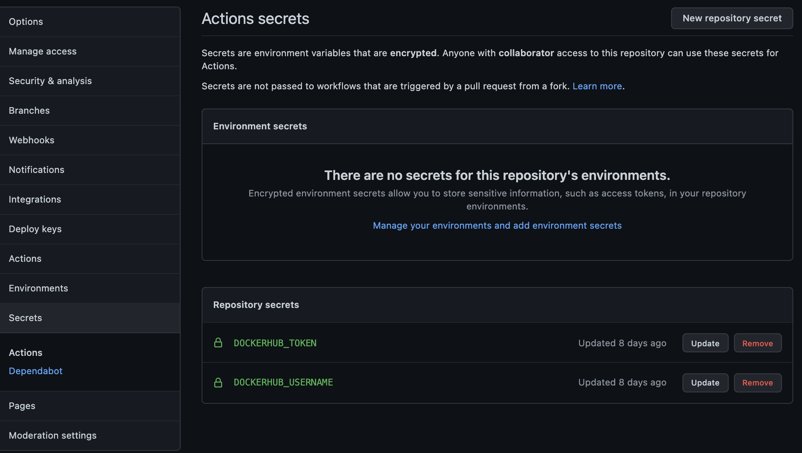
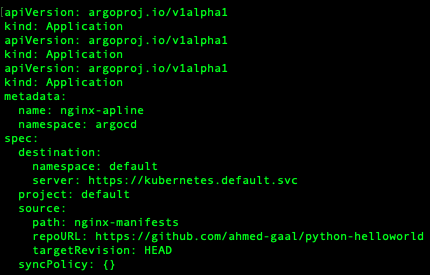

# Python-Helloworld

This is a simple python hello world application to simulate
 ```continuous integration``` and  ```continuous delivery``` popularly known
 as **CI & CD.**

We will employ **GitHub Actions** for **Continuous Integration** and **ArgoCD**
for **Continuous Delivery** throughout this repository.

## GitHub Actions for Continuous Integration
**********
*   To use **Github Actions** simply include a **.github/workflows** directory
    at the root of your project using:
```
mkdir .github
```
```
mkdir .github/workflows
```

*   Inside the workflows directory, create a **docker-build.yml** file
    and copy the contents of this [file](/.github/workflows/docker-build.yml)

*   Make sure to set access keys to your Docker registry on Github as below.
    

*   Finally just add & commit your changes and push the code to Github to 
    trigger the workflow.

## ArgoCD Continuous Delivery
**********
*   Assuming you have a running VM instance, run vagrant in secure shell
```
vagrant ssh
```
*   Install **apparmor**
```
zypper in -t pattern apparmor
```
*   Install ArgoCD CLI using Homebrew
```
brew install argocd
```
*   Create Namespace
```
kubectl create ns argocd
```
*   Install all dependencies
```
kubectl apply -n argocd -f https://raw.githubusercontent.com/argoproj/argo-cd/stable/manifests/install.yaml
```
*   Get all services on the cluster using:
```
kubectl get svc -n argocd
```
*   Create a NodePort server using:
```
kubectl get svc -n argocd argocd-server -o yaml > argocd-nodeport.yaml
```  
and edit to output like this:


*   Apply the new service using:
```
kubectl apply -f argocd-nodeport.yaml
```
*   Verify that new service is added using:
```
kubectl get svc -n argocd 
```
*   Access the argocd Ui using VM IP on the Vagrantfile **192.168.50.4:30007/8**
*   Create Login using the instructions on the docs which will generate a password:
```
kubectl -n argocd get secret argocd-initial-admin-secret -o jsonpath="{.data.password}" | base64 -d
```
*   Log in using **admin** as **username** and the newly generated password
*   Once logged in to the ArgoCD server, applications can be created
*   Create an Application Custom Resource Definition using:
```
argocd-python.yaml
```


*   Deploy to kubernetes using declarative method:
```
kubectl apply -f argocd-python.yaml
```
*   Verify applications are deployed to argocd namespace using:
```
kubectl get application -n argocd
```
*   Head over to the UI and synchronize
*   To verify that application is running execute:
```
kubectl get po -n argocd
```
*   Repeat 5th last step to redeploy new versions using new Application CRDs


